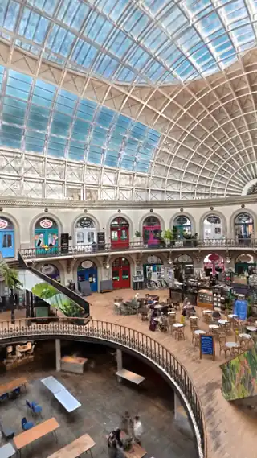
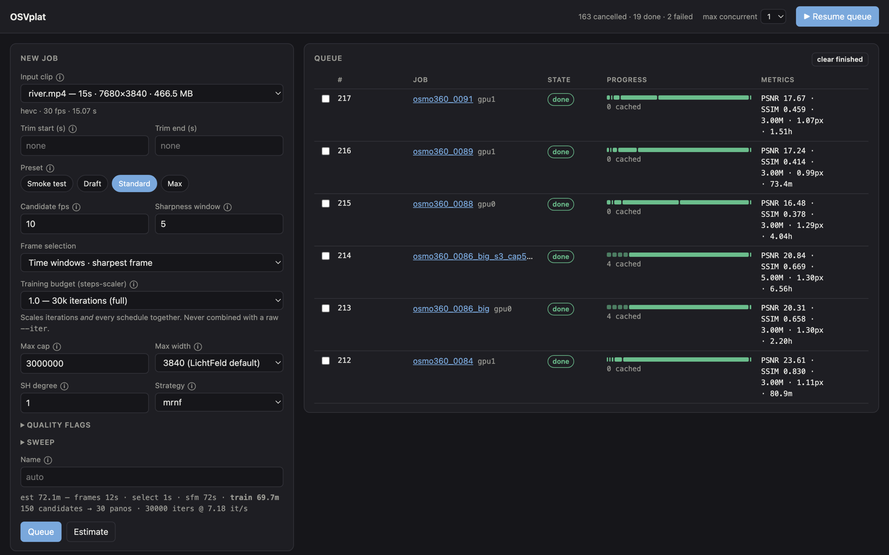
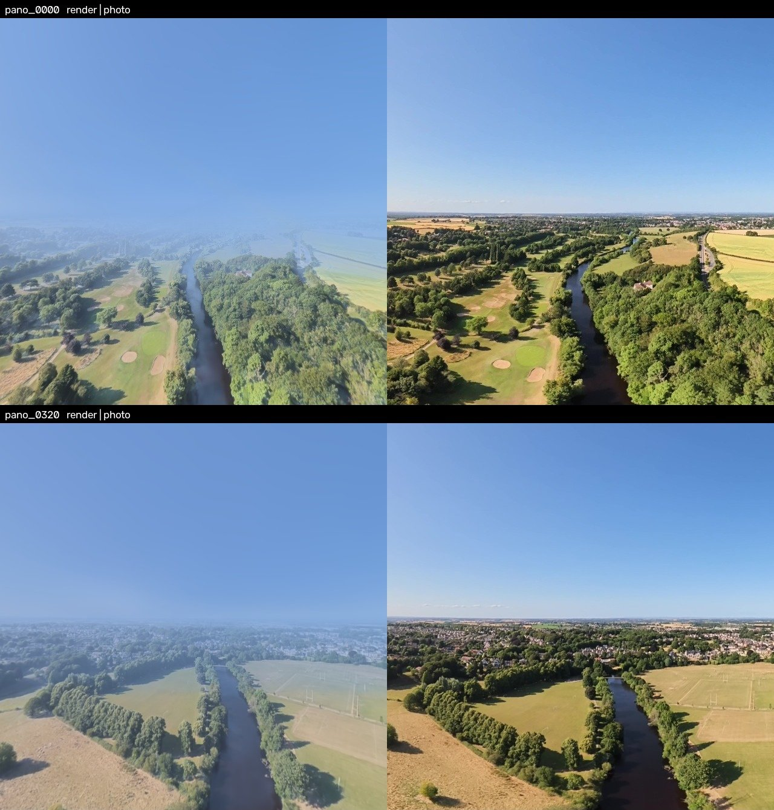

# OSVplat

**Raw DJI `.OSV` dual-fisheye → Gaussian splat. No stitch.**

OSVplat turns a DJI Osmo 360 or Avata 360 `.OSV` into a flyable 3D Gaussian
splat. It keeps both fisheye lenses as a calibrated rig instead of stitching
first. Copy the clip to your Linux GPU workstation, pick a preset in a small
web UI, and an hour or two later download `.ply`, `.sog` and `.spz` files.

<p align="center">
  
</p>

<p align="center"><i>A fly-through of a splat trained from a single handheld Osmo 360 walk.</i></p>

## What it does

- **Reads DJI's raw dual-fisheye `.OSV` directly.** No DJI Studio stitching. It
  decodes the per-unit lens calibration stored in the file and reconstructs both
  lenses as a calibrated two-camera rig. That registers about 2× the 3D points
  of a stitched panorama with lower error ([how it works](docs/how-it-works.md#fisheye-rig-no-stitch)).
  Stitched 2:1 equirectangular video works too, e.g. a graded D-Log export from
  DJI Studio or footage from another 360 camera ([details](docs/how-it-works.md#stitched-video-input-graded-or-d-log-footage)).
- **Complete pipeline, cached per stage.** GPU frame decode → sharpest-frame
  selection → optional person masking → COLMAP SfM on the GPU →
  [LichtFeld Studio](https://github.com/MrNeRF/LichtFeld-Studio) training →
  export. Change a training option and everything before training is reused.
- **Web queue.** Submit jobs, watch progress per stage, see time estimates
  and PSNR/SSIM, compare runs, run parameter sweeps, and download results. It
  runs as a systemd service, so jobs survive closing the browser or logging out.
- **Removes the operator.** Handheld and selfie-stick captures can mask people
  (Mask R-CNN, or SAM 3 with text prompts like `"person", "dog"`), with an
  optional review step before the GPU-hour is spent.
- **Uses the camera's telemetry.** Decodes the `.OSV` orientation stream (1–4 kHz)
  and can veto frames whose rotation predicts motion blur.





*Low aerial 360 pass along a river. Left: rendered from the splat. Right: the camera frame.*

## Requirements

- A Linux workstation with an **NVIDIA GPU**, RTX 20xx or newer (developed on
  RTX 3090s; a Standard run peaked at 10 GB of VRAM), and ~20 GB of free disk
  per clip.
- Clips from a DJI Osmo 360 or Avata 360 (`.OSV`), or any stitched
  equirectangular video (`.mp4`, 2:1).

## Quick start

**With Docker** (recommended; needs the
[NVIDIA Container Toolkit](https://docs.nvidia.com/datacenter/cloud-native/container-toolkit/latest/install-guide.html)):

```bash
git clone https://github.com/pgodlews/OSVplat.git ~/osvplat && cd ~/osvplat
cp .env.example .env && mkdir -p samples data models
sed -i "s/^UID=.*/UID=$(id -u)/; s/^GID=.*/GID=$(id -g)/" .env
docker compose pull && docker compose up -d     # or build it here: docker compose up -d --build
docker compose logs queue | grep token          # the URL to open
cp /media/$USER/SD/DCIM/DJI_001/CAM_*.OSV samples/
```

Until a prebuilt image is published on GHCR, use the `--build` form: about an
hour, once. Details, settings and updating: **[docs/docker.md](docs/docker.md)**.

**Native install** (builds the tools on the workstation, about an hour, after the
system packages in [docs/install.md](docs/install.md#1-system-packages)):

```bash
git clone https://github.com/pgodlews/OSVplat.git ~/osvplat && cd ~/osvplat
scripts/setup.sh              # pycolmap-cuda, gsplat, LichtFeld Studio
./queue/deploy.sh             # installs the queue as a systemd service, prints its URL
cp /media/$USER/SD/DCIM/DJI_001/CAM_*.OSV ~/splat/samples/
```

## Usage

1. Open the queue's URL (`http://gpu-workstation:8090/?token=…`),
   in a browser on the workstation or any machine on your network. The queue
   starts **paused**, so press **Resume queue**.
2. Under **New job**, pick your clip in **Input clip**. `.OSV` files are
   detected as fisheye rigs automatically.
3. Pick a **Preset**:
   - **Smoke test**: about 10 minutes, on the first 30 s of the clip; checks
     the whole chain works on your machine. Not meant to be looked at.
   - **Draft**: 15k iterations, 1M splats. A 2.5-minute Osmo clip took 35
     minutes on an RTX 3090: a quick look at whether the clip reconstructs.
   - **Standard**: 30k iterations, 3M splats; the settings every measurement
     in the docs used.
   - **Max**: Standard with full-resolution training and SH degree 3 (more
     view-dependent colour), for a final result. Slower than Standard.

   Trim start/end to skip the take-off, landing or the walk back to the car.
4. Person masking is on by default for Osmo 360 clips (the operator is always
   in shot) and off for the Avata 360. Change it under **Quality flags**, where
   you can also pick the **Mask backend**: Mask R-CNN (people, no setup) or
   SAM 3 (anything you name, after a one-time weights download:
   [docs/docker.md](docs/docker.md#sam-3-masks-optional)).
5. **Estimate** shows the expected time per stage. **Queue** submits the job.
   Click the job name to see per-stage progress, logs and final metrics.

When the job is done, its page shows **Download** buttons for the `.ply`,
`.sog` and `.spz` files (`GET /api/jobs/<id>/files` from a script).

**Viewing:** drag the `.sog` or `.ply` into the
[SuperSplat editor](https://superspl.at/editor), or host the `.sog` with any
static web splat viewer.

**Scripting:** everything the UI does is a JSON API. See
[queue/README.md](queue/README.md#api). For example:

```bash
TOKEN=$(cat data/.queue_token)     # Docker; native: see queue/README.md
curl -H "X-Queue-Token: $TOKEN" -H 'Content-Type: application/json' \
     -d '{"config": {"name": "my_clip", "input": {"file": "samples/my_clip.OSV"}}}' \
     http://localhost:8090/api/jobs
```

## Tips for good results

**Fly or walk low and slow, orbit what you care about, and stay over land.**
Water, sky, and moving people and cars add nothing and turn the far field into
haze. Use a fast shutter, because blur costs more than resolution. For more,
see [Capturing for a good splat](docs/how-it-works.md#capturing-for-a-good-splat).

## Documentation

| | |
|---|---|
| [docs/docker.md](docs/docker.md) | Running with Docker Compose, settings, updating, verifying and publishing the image |
| [docs/install.md](docs/install.md) | Native install without Docker |
| [docs/how-it-works.md](docs/how-it-works.md) | Stages, fisheye rig vs stitching, masking, gyro veto, output formats, with measurements |
| [docs/troubleshooting.md](docs/troubleshooting.md) | Known traps, numbered (code comments cite them) |
| [queue/README.md](queue/README.md) | Queue service internals, job options, API, tests |
| [docs/osmo360-telemetry.md](docs/osmo360-telemetry.md), [docs/avata360-telemetry.md](docs/avata360-telemetry.md) | What is inside a DJI `.OSV`: lens calibration, IMU, GPS |

## Limitations

- Linux + NVIDIA only (driver 580+). Stages call CUDA builds of ffmpeg, COLMAP and LichtFeld.
- One queue per machine. Multiple GPUs are scheduled, but there is no multi-machine support.
- Insta360 `.insv` is not supported (its calibration is not decoded). Stitch it
  to an equirectangular MP4 first.
- Long fisheye clips (more than ~500 selected frames) make SfM slow. Trim the clip or
  raise the sharpness window.
- Tested on two machines so far: a desktop with 2× RTX 3090 and a Ryzen mini PC
  with an RTX 3090 over OcuLink, both Ubuntu 24.04. Issues and PRs are welcome,
  especially reports from other GPUs and cameras.

## Acknowledgements

Built on [COLMAP](https://colmap.github.io/) / pycolmap (BSD),
[LichtFeld Studio](https://github.com/MrNeRF/LichtFeld-Studio) (GPL-3.0, built
and run as a separate program), [gsplat](https://github.com/nerfstudio-project/gsplat)
(Apache-2.0), [FFmpeg](https://ffmpeg.org/), torchvision's Mask R-CNN (BSD),
and optionally Meta's [SAM 3](https://huggingface.co/facebook/sam3) (SAM
licence). Field names for DJI's telemetry come from AdrianEddy's
[telemetry-parser](https://github.com/AdrianEddy/telemetry-parser).
`scripts/colmap_incremental.py` is adapted from COLMAP's own example and keeps
its BSD notice.

Not affiliated with or endorsed by DJI.

## License

Copyright © 2026 Piotr Godlewski. Released under the [MIT License](LICENSE).
Third-party components keep their own licences; see [THIRD_PARTY.md](THIRD_PARTY.md).
