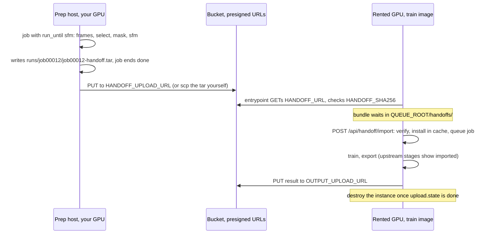

# Rented GPUs (Vast.ai, RunPod)

The same image runs as a single container on a rented GPU. There is no Compose
there: the provider starts the image itself, gives it one disk, and has root
over it. Everything below is off unless its variable is set, so a Compose
install behaves as before.

What the image adds for this:

- **SSH into the container**, keys only, so the UI and files are reached through
  `ssh -L` instead of an open port.
- **`INPUT_URL`**: the container fetches the clip itself (a presigned S3 GET).
- **`OUTPUT_UPLOAD_URL`**: each finished job's splats go up as one tar (a
  presigned S3 PUT), so no results have to be pulled.
- **A split pipeline**: frames, masks and SfM on your own GPU, only training
  on the rented one, joined by a handoff bundle ([below](#split-pipeline)).
- **CPU and GPU discovery**, used on every install: stages are sized to the CPUs the container
  is allowed, not the host's cores, and GPUs the image cannot run on are
  listed but never scheduled.

Needs image **0.1.3 or newer** for everything on this page. 0.1.1 was built
with `-march=native` on an AVX-512 CPU, and its training crashes on most rented
EPYC and Ryzen hosts ([troubleshooting #25](troubleshooting.md)); 0.1.2 fixed
that but has none of the remote features.

## The trust model

The host's root can read everything in the container while it runs: the clip,
the results, the queue token, anything you type. So:

- Put nothing there that reaches further than this run. A presigned URL
  can read or write one object until it expires; an AWS key, a Hugging Face
  token (SAM 3) or a forwarded SSH agent can do much more.
- sshd refuses agent forwarding, so `ssh -A` does nothing. Don't
  forward an agent to a rented host by other means.
- Check the host key the first time you connect: the fingerprints are in the
  container log, which both providers show outside the container.
- Destroy the instance when done, don't just stop it (see below).

## Quick start

On your machine, make the two URLs (needs `pip install boto3` and your normal
AWS credentials, which stay on your machine):

```bash
scripts/presign_s3.py s3://my-bucket/osvplat/run1 --clip ~/clips/DJI_0198.OSV --expires 24
```

It uploads the clip and prints `INPUT_URL`, `INPUT_SHA256` and
`OUTPUT_UPLOAD_URL`. A presigned URL cannot outlive the credentials that
signed it: with temporary credentials (`aws login`, SSO, an assumed role) it
stops working when that session ends, whatever `--expires` says. With
`aws login` credentials boto3 also needs `pip install "botocore[crt]"`. Start the container with those plus your SSH public key
(the provider-specific parts are below):

```bash
docker run -d --gpus all -p 2222:22 \
  -e SSH_PUBLIC_KEYS="$(cat ~/.ssh/id_ed25519.pub)" \
  -e INPUT_URL='https://…' -e INPUT_SHA256=… -e OUTPUT_UPLOAD_URL='https://…' \
  ghcr.io/pgodlews/osvplat:0.1.3
```

The log prints the connect line:

```
OSVplat: ssh -p 40178 -L 8090:localhost:8090 root@203.0.113.10
  then open http://localhost:8090/?token=…
```

Connect, open the UI, queue the clip (it appears in the input list once the
download has finished), press **Resume queue**. When the job is done its
splats are uploaded; `GET /api/jobs/<id>` shows `upload.state`, `bytes` and
`sha256`, and the log prints the same. Download the result, compare the
sha256, then destroy the instance.

## Settings

| Variable | | |
|---|---|---|
| `SSH_PUBLIC_KEYS` | one or more public keys, one per line | starts sshd |
| `SSH_PUBLIC_KEY`, `PUBLIC_KEY` | what Vast and RunPod inject from your account's keys | also start sshd |
| `SSH_KEYS_URL` | `https://` list of keys, e.g. `https://github.com/<user>.keys` | an empty list is an error |
| `SSH_PORT` | 22 | |
| `QUEUE_BIND` | `127.0.0.1` with SSH on, else `0.0.0.0` | where the UI listens |
| `INPUT_URL` | URL of one clip, fetched into `samples/` at start | name from the URL path, or `INPUT_NAME` |
| `INPUT_SHA256` | checked before the clip is used; a mismatch deletes it | recommended |
| `OUTPUT_UPLOAD_URL` | presigned PUT URL, or a JSON target (below) | upload after each job that ends done |
| `HANDOFF_URL` | URL of one [handoff bundle](#split-pipeline), fetched into `QUEUE_ROOT/handoffs/` at start | name from the URL path, or `HANDOFF_NAME`; import it with the API |
| `HANDOFF_SHA256` | checked before the bundle is kept; a mismatch deletes it | recommended |
| `HANDOFF_UPLOAD_URL` | presigned PUT URL, or a JSON target, like `OUTPUT_UPLOAD_URL` | upload after each job with `run_until: "sfm"` |
| `CHECKPOINT_UPLOAD_URL` | presigned PUT URL, or a JSON target | a [restore point](#spot-gpus-restore-points-and-resume) after each training snapshot, replacing the last |
| `RESUME_URL` | URL of one restore point, fetched into `QUEUE_ROOT/resume/` at start | name from the URL path, or `RESUME_NAME`; resume it with the API |
| `RESUME_SHA256` | checked before the restore point is kept | the object changes after each snapshot, so only when you know which one you fetch |
| `QUEUE_PREEMPT_WATCH` | `off` | `aws` or `gcp`: poll for a reclaim notice and snapshot every running training |
| `QUEUE_RESTORE_POINTS` | 0 | `1` makes restore points without `CHECKPOINT_UPLOAD_URL`, kept in the job's run dir |
| `QUEUE_DEBUG` | `basic` | how much a failed job's [debug bundle](#debug-bundles) holds: `off`, `basic`, `artifacts`, `heavy` |
| `QUEUE_DEBUG_MAX_GB` | 4.5 | size cap for the bundle; what does not fit is listed in its manifest |
| `DEBUG_UPLOAD_URL` | presigned PUT URL, or a JSON target | upload the bundle when a job fails |
| `QUEUE_CPUS` | discovered | override the CPU count stages are sized to |
| `QUEUE_MIN_COMPUTE_CAP` | 7.5 | GPUs below this are listed but not scheduled |
| `QUEUE_HANDOFF_KEEP` | 0 | `1` keeps a handoff bundle's tar after it has been imported |
| `QUEUE_TLS_INSECURE` | 0 | `1` accepts self-signed certificates for `INPUT_URL`, `HANDOFF_URL`, the upload URLs, telemetry and the webhook |

SSH needs the container to run as root, which is what both providers do; with
Compose's `user:` set, the SSH variables are refused with an error.

`OUTPUT_UPLOAD_URL` details:

- The tar holds the job's `.ply`/`.sog`/`.spz` and `telemetry.json` under
  `job<id>/`. After a PUT, the `ETag` S3 returns (the stored object's MD5)
  is compared with the archive's; a mismatch fails the upload. (0.1.3 sent a
  `Content-MD5` header instead, which AWS refuses on a presigned PUT: use a
  POST target with 0.1.3, or 0.1.4.)
- A plain presigned URL names **one object**, so it is used once: the first
  job that finishes uploads, and later jobs are refused
  (`upload.state: refused`) rather than overwriting it. For several jobs, use a
  JSON target with a `{job}` placeholder, in the same format as
  `QUEUE_TELEMETRY_UPLOAD` ([job-telemetry.md](job-telemetry.md)); a presigned S3
  POST whose policy allows a key prefix works for that.
- Failures are loud: `upload.state: failed` with the HTTP status (an expired
  URL gives 403), a line in the service log, and the `job.uploaded` webhook
  event. The archive stays in `runs/job<id>/`, so it can still be copied off
  over SSH. The job itself stays done.
- Checked before any job runs, without using the URL up (a presigned PUT
  cannot be tried without writing the object). The service logs when the
  URL expires, as written in the URL itself or in a POST policy, and whether
  the host resolves and accepts a TCP connection on its port. A malformed
  or already expired `OUTPUT_UPLOAD_URL` makes the API refuse new jobs
  (HTTP 400), while SSH and the UI stay up. The service logs a warning for a
  job submitted when the URL has less than an hour left. The job-creation
  response carries `upload_expires_in_s`.
- A malformed telemetry setting (`QUEUE_TELEMETRY_UPLOAD`,
  `QUEUE_TELEMETRY_PLACEMENT`) never stops jobs: it is logged and ignored, and
  telemetry is still written locally.

`QUEUE_TLS_INSECURE=1` is for a private endpoint with a self-signed
certificate, on a network you trust. With it, anyone on the path can read and
change the transfers, presigned URLs included. The service logs a warning at
startup while it is on.

## CPU and GPU discovery

The service logs what it found at startup, e.g. with `--cpus=2.5`:

```
resources: 2 CPUs (cgroup quota 2.5 of 8 visible), 33 GB RAM, 2 threads per stage; …
```

The CPU count is the smaller of the CPU affinity and the cgroup quota, split
between jobs that can run at once. Stages get it as `SPLAT_THREADS` (COLMAP's
thread count) and `OMP_NUM_THREADS`. Why it matters, measured on 2026-09-21 with
the Smoke test preset on the 0198 clip: a RunPod pod showed 112 CPUs against a
23.8-CPU quota, COLMAP started 178 threads, and SfM took 3267 s. A Vast host
whose 16 visible CPUs matched its allowance did the same SfM in 1270 s. (Those
runs predate this change; the 3267 s has not been re-measured with it.)

On rented hosts SfM, which runs on the CPU, is the slow stage: training the
same Smoke test took 122 s on an L4 and 96 s on a 3090. Pick offers by CPU as
well as GPU, and by speed per core rather than core count. Smoke test SfM on
the 0198 clip, 76 frames:

| Host | CPUs used | SfM |
|---|---|---|
| Vast, Ryzen 7 7700X (2022) | 16 | 1270 s |
| Vast, EPYC 7R32 (2020) | 46 of 96 | 2855 s |
| RunPod, EPYC 7663, 178 threads on a 23.8-CPU quota (before this release) | 23 | 3267 s |

GPUs are checked against the build. The image records the architectures it
was compiled for (`OSVPLAT_CUDA_ARCH`, from the build's `CUDA_ARCH`). A card is
usable when one of them has the same major version and a minor version no
higher than the card's: code built for 8.6 runs on an L4 (8.9), not on an
RTX 5090 (12.0). Other cards, and anything below 7.5, show as unsupported with
the reason in the startup log and the UI, and are never scheduled. When no GPU
here can run the build, the API refuses new jobs (HTTP 400) instead of queueing
them. This matters for local builds trimmed to one card
(`--build-arg CUDA_ARCH=8.6`) that later run on another.

Measured with the published 0.1.3 image (10 s Draft job on the 0198 clip,
2026-09-22):

| CC | Card | Training | PSNR / SSIM |
|---|---|---|---|
| 7.5 | RTX 2080 Ti (Vast) | **refused**: LichtFeld was built for 8.6 only ([troubleshooting #31](troubleshooting.md)) | – |
| 8.0 | A100 | refused by the same floor (not run) | – |
| 8.6 | RTX 3090 | 624 s | 35.18 / 0.9714 |
| 9.0 | H100 SXM (Vast) | 566 s | 35.42 / 0.9715 |
| 12.0 | RTX 5060 Ti (Vast) | 1132 s | 35.39 / 0.9714 |

9.0 and 12.0 run from the 8.6 PTX that the driver compiles at startup.
`scripts/setup_lichtfeld.sh` on main builds LichtFeld for every architecture in
`CUDA_ARCH` and stops the build if it did not; the first image with that fix
still has to be run on a 7.5 and an 8.0 card.

Rented hosts can be faulty in ways `nvidia-smi` does not show. At startup the
service also checks that CUDA itself starts (`cuInit`); on a host where it does
not, the log says the host is faulty and jobs are refused
([troubleshooting #29](troubleshooting.md)). Destroy it and rent another.

## Vast.ai

- Launch in **entrypoint mode**. The SSH and Jupyter modes replace the
  image's entrypoint with Vast's own setup, and with this image that setup
  fails: Vast's sshd expects host keys baked into the image, and this image
  deliberately has none ("sshd: no hostkeys available -- exiting", seen on
  2026-09-22). Entrypoint mode is not the default everywhere: the `vastai` CLI
  and the API create SSH-mode instances unless told otherwise. With the CLI,
  end the command with an empty `--args`:

  ```bash
  vastai create instance <offer> --image ghcr.io/pgodlews/osvplat:0.1.3 --disk 100 \
    --env "-p 22:22 -e SSH_PUBLIC_KEYS='ssh-ed25519 AAAA… you@host'" --args
  ```

  With the API or SDK, pass `runtype: "args"`.
- Docker options: `-p 22:22` (plus `-e` for the variables above). Vast maps
  ports to random external ones and prints the right `ssh -p` line in our log
  from `VAST_TCP_PORT_22` and `PUBLIC_IPADDR`. Search with
  `direct_port_count>0`.
- Keys: Vast injected the account's SSH keys as `SSH_PUBLIC_KEY` in SSH mode;
  in entrypoint mode, pass `SSH_PUBLIC_KEYS` with `-e` to be sure.
- Disk is fixed at creation: the image is 19 GB, a clip's job data ~20 GB.
- Filters used: `driver_version>=580.0.0` (the image needs CUDA 13), `cpu_cores_effective>=8`,
  `inet_down>=500`, `verified=true`, `reliability>0.98`.

## RunPod

- A Pod from a custom template with this image, **TCP port 22** exposed.
  Don't expose 8090 as an HTTP port: RunPod's proxy makes it public, and
  requests over 100 s (uploads, log streams) are cut off.
- Keys: RunPod injects your account's SSH keys as `PUBLIC_KEY`, and the
  string `null` when the account has none; that is ignored, so pass your key
  as `SSH_PUBLIC_KEYS` ([troubleshooting #27](troubleshooting.md)). The log's
  connect line uses `RUNPOD_PUBLIC_IP` and `RUNPOD_TCP_PORT_22`.
- The container log, with the host key fingerprints, is only shown in
  RunPod's web console (the API has no log endpoint), so compare the
  fingerprint there on the first connection.
- Container start command: leave it empty.
- Container disk: ~60 GB. Anything outside `/workspace` is lost when a pod
  is stopped.

## Split pipeline

On a rented GPU, everything before training is billed at the GPU's rate while
the GPU mostly waits. Measured on clip 0141 (Avata 360, 473 rig frames = 946
images, 2026-09-28):

| Stage | 5090 host | L4 host | GPU use | Disk written |
|---|---|---|---|---|
| frames | 4.7 min | 3.3 min | ~none (CPU decode works) | 5.5 GB |
| select | 0.1 min | 0.2 min | none | – |
| mask | 3.1 min | 8.1 min | yes (Mask R-CNN, 8.5–11 GB) | 3.5 GB |
| sfm | 38.6 min | 58.2 min | SIFT extraction (3.6 min) and matching (4.0 min) only; ~31 min of CPU mapping | 2.2 GB |
| train | 61.7 min | 408 min | yes | 2.0 GB |

The train row is two different budgets (the 5090's is the 40k-iteration run
in [#7](https://github.com/pgodlews/OSVplat/issues/7)), so it shows the share
of the job, not a card comparison.

The split runs the first four stages on a machine of your own with a GPU (a
3090 is plenty; mapping is mostly serial, so a strong single-thread CPU
matters more than cores), and only training on the rented one. Only
training is then at risk on an interruptible instance.

Two images of the same release do it ([docker.md, "Three
images"](docker.md#three-images)): `osvplat:<ver>-prep` and
`osvplat:<ver>-train`. The all-in-one `osvplat:<ver>` does either half too.



**1. Prep, at home.** Start the prep image like the all-in-one one (Compose
with `IMAGE=ghcr.io/pgodlews/osvplat:<ver>-prep`, or `docker run`), and queue
the clip with `run_until`:

```bash
curl -sS -X POST -H "x-queue-token: $QUEUE_TOKEN" -H 'content-type: application/json' \
  localhost:8090/api/jobs -d '{"config": {"name": "0141", "input": {"file": "samples/0141.OSV"},
                              "run_until": "sfm"}}'
```

The job runs frames, select, mask and SfM, marks train and export skipped,
writes `runs/job<id>/job<id>-handoff.tar`, and ends done. Writing the
bundle is part of the job: a stage that no longer verifies fails it rather
than ending done with nothing to hand on. `GET /api/jobs/<id>/handoff` gives
its `sha256` and size, `GET /api/jobs/<id>/handoff/download` the file. With
`HANDOFF_UPLOAD_URL` set it also goes up after the job, like
`OUTPUT_UPLOAD_URL` (streamed, `ETag` checked against its MD5, a fixed URL
used once, a `{job}` placeholder for more; `upload` in the handoff status).
A job that has already run past SfM can write one too:
`POST /api/jobs/<id>/handoff` (`?send=1` also uploads it).

`run_until` enters no cache key: a prep job and an all-in-one job on the
same clip and options share every cache entry. `frames`, `select` and `mask`
are accepted too; they stop there and write no bundle.

**2. Train, rented.** Start the train image with the bundle instead of the
clip:

```bash
docker run -d --gpus all -p 2222:22 \
  -e SSH_PUBLIC_KEYS="$(cat ~/.ssh/id_ed25519.pub)" \
  -e HANDOFF_URL='https://…' -e HANDOFF_SHA256=… -e OUTPUT_UPLOAD_URL='https://…' \
  ghcr.io/pgodlews/osvplat:<ver>-train
```

Once it has downloaded (`GET /api/handoff/bundles` lists what is in
`QUEUE_ROOT/handoffs/`), import it and resume the queue:

```bash
curl -sS -X POST -H "x-queue-token: $QUEUE_TOKEN" -H 'content-type: application/json' \
  localhost:8090/api/handoff/import -d '{"bundle": "job00012-handoff.tar", "sha256": "…"}'
```

The import checks the bundle against its manifest, installs the selected
images, masks and SfM dataset in the cache under their keys, and queues a job
that starts at train. Its upstream stages show as `imported`, it never looks
for the clip, and it delivers through `OUTPUT_UPLOAD_URL` like any job.
`train` and `export` in the request replace those sections of the bundle's
config: a different budget trains from the same SfM. `name` and `priority`
are optional. Once every file has been verified and installed, the tar is
deleted: kept, it doubles the train side's input on disk. `"keep": true` in
the request, or `QUEUE_HANDOFF_KEEP=1`, keeps it to import again.

**Batches.** Copy more bundles into `QUEUE_ROOT/handoffs/` (`scp`, `rsync`)
and import each; the jobs run back to back. `HANDOFF_URL` fetches one.

**What the bundle holds.** A tar of the selected images, the person masks
(when on), and the SfM dataset LichtFeld reads, plus a manifest,
`handoff.json`, written last: the job config, every cache key, the version
terms from `queue/app/jobs.py` (`config_version`, `FISHEYE_PIPELINE`,
`FISHEYE_SFM`, `IMU_SELECT`, `UPRIGHT`), the image version and revision,
and a sha256 and size per file. The images travel, rather than frames being
decoded again on the train side, so nothing depends on two hosts decoding a
clip bit-identically. No frames, overlays, SfM databases or telemetry: each
side keeps its own record, joined by a random handoff id
([job-telemetry.md](job-telemetry.md#split-pipeline)). Like a debug bundle,
it is not anonymous: the manifest holds the job's name and the clip's file
name.

**What is refused**, with HTTP 400 and nothing installed or queued:

- a whole-file `sha256` that does not match, when one is given;
- a truncated bundle (the manifest is the last member, so a cut-off tar has
  none), or one that is not a tar;
- version terms that differ from this image's, or cache keys this image
  computes differently from the manifest's config. Prep and train must come
  from the same release, or at least one with the same version terms;
- a file whose sha256 or size differs from the manifest, a member the
  manifest does not list, one it lists that is missing, or a path or link
  that leaves the bundle's stage directories;
- masks under review that were never approved;
- the import on a prep image, and on a train image any job that would have to
  start from the clip (the error names the image to use). A prep image
  refuses jobs without `run_until`.

An imported stage whose cache entry is gone by the time its job runs (the
cache evicted it, or it was deleted) fails the job with the bundle's name to
import again; it is never rebuilt, because this machine has no clip.

**Measured, first split run** (2026-09-29, 0.2.0-rc1, clip 0005: Osmo 360,
trimmed to 286.9 s, 957 panoramas). Prep on an RTX 3090 with a Ryzen 7 H 255:
frames 12.7 min, select 0.2, mask 8.5, SfM 57.5; SfM registered 957/957 at
1.07 px with 832k points, as the all-in-one run did. The bundle is 5.45 GB in
8,622 files, 4.84 GB of it the 1,914 selected images (about 2.5 MB each), so
it grows with the frame count rather than the clip's size. On a rented RTX
3090: download 242-390 s from R2 (14-23 MB/s), import 40.6 s, training
113.8 min, PSNR 21.92 / SSIM 0.673 against 21.9 for the all-in-one run of
the same clip. The train side's disk peaked at 6.8 GB with the tar deleted
(5.5 GB of imported cache, 1.3 GB written by training), RAM at 10.2 GiB.
Image downloads (compressed) and sizes on disk: all-in-one 6.86 / 21.5 GB,
prep 5.46 / 15.7 GB, train 3.45 / 11.6 GB.

**The train host needs an x86-64-v3 CPU** (AVX2 and FMA: Intel Haswell, AMD
Zen 1 or newer). LichtFeld is built for that level, and an older CPU dies
with SIGILL when training starts ([troubleshooting #35](troubleshooting.md)).
The service checks at startup and refuses imports and training jobs on such
a host; `GET /api/status` shows the reason as `cpu_error`.

## When the instance dies mid-job

Rented GPUs get interrupted: interruptible/spot instances are reclaimed,
hosts go offline, a pod is terminated by mistake. What that costs:

- **The work so far is lost with the instance's disk**, unless training
  sends [restore points](#spot-gpus-restore-points-and-resume). The stage cache,
  logs and partial training live in `QUEUE_ROOT` (`/data`) on the instance.
  A replacement instance starts from frames again, unless `QUEUE_ROOT` is on
  storage that outlives it: a RunPod network volume, or `/workspace`, which
  survives a stop but not a terminate. On Vast the disk goes with the
  instance.
- **No half-written result reaches the bucket.** The tar is written under a
  temporary name and renamed when complete. It then goes up in a single PUT
  (or POST), which S3 stores only once the whole body has arrived (its
  length is fixed by `Content-Length`). An upload cut off halfway leaves
  nothing, or the previous object, never a truncated file.
- **The presigned URLs outlive the instance.** They work until they expire,
  for whoever has them, and the host could read them. Keep `--expires` close
  to the run's length. Give each run its own result key (or prefix), so a
  late or repeated upload cannot overwrite another run's result.
- Nothing retries the job on another instance. Check the result exists
  (`upload.state: done` and its sha256), not just that the instance is gone.

## Spot GPUs: restore points and resume

Interruptible GPUs cost a third to a half of on-demand. With restore points a
reclaim costs the steps since the last one plus a restart elsewhere, instead of
the whole training. Measured for [#10](https://github.com/pgodlews/OSVplat/issues/10)
on RTX 3090s (clip 0005, 30k steps, 3M splats): runs killed at 15k or 20k and
resumed, on the same machine or another, finished at PSNR 21.909–21.915,
against 21.897 and 21.905 uninterrupted.

**Snapshots.** `train.checkpoint_every: 5000` snapshots the training every
5000 steps (the job's own steps, after `steps_scaler`; at least 500; not part
of the cache key). Each pauses training for about 0.1 s and adds a checkpoint
to the run's `project.licht`, about 0.5 GB at 3M splats and SH 1. Off (0), the
trainer keeps its defaults.

**Restore points.** After each snapshot, `scripts/licht_restore_point.py` keeps
only the newest checkpoint of the run's project (LichtFeld's own
`clean_project_file`: 1.56 GB to 467 MB in 1.5 s, measured) and the queue packs
it as `job<id>-restore.tar` with `restore.json`: the job config and cache keys,
the trainer and cache-key version terms, the cache root, the step, and the
checkpoint's sha256. With `CHECKPOINT_UPLOAD_URL` it is uploaded, replacing the
previous one: S3, R2 and GCS replace an object only once the new upload is
complete, so a reclaim mid-upload leaves the previous restore point. A URL
without `{job}` names one object and belongs to the first job that uploads
there. A restore point that cannot be made or sent is recorded
(`checkpoints` in `GET /api/jobs/<id>`, and telemetry) and training goes on.
Upload a bucket in the GPU's own region: 470 MB took 38 s over a home uplink.

**Reclaim notices.** `QUEUE_PREEMPT_WATCH=aws` polls the instance metadata
every 5 s. On the 2-minute spot interruption notice every running training is
snapshotted at once (SIGUSR1, a patch in `scripts/lichtfeld-patches/`) and the
queue is paused; a rebalance recommendation snapshots without pausing. A
container reaches IMDSv2 only with the instance's metadata hop limit at 2.
`QUEUE_PREEMPT_WATCH=gcp` watches `instance/preempted`; a GCP Spot VM gets no
more than about 30 s by default (120 s in Preview), so there the scheduled
snapshots do most of the work. Vast and RunPod send no reliable notice.
Measured: 3.4 s from the request to a verified restore point, then the upload.
`POST /api/snapshot` does the same by hand, e.g. before stopping an instance.

**Resuming.** Start the train image with `HANDOFF_URL` (the prep job's
bundle) and `RESUME_URL` (the restore point); `GET /api/resume` lists what
arrived in `QUEUE_ROOT/resume/`. Then import both and resume the queue:

```bash
curl -sS -X POST -H "x-queue-token: $QUEUE_TOKEN" -H 'content-type: application/json' \
  localhost:8090/api/resume/import -d '{"restore": "job00003-restore.tar", "bundle": "job00001-handoff.tar"}'
```

The restore point is refused unless it was made by the same trainer
(`TRAINER`), the same cache-key version terms and the same `QUEUE_ROOT`: the
checkpoint's cameras refer to the dataset by absolute path. The queued job
takes its upstream stages from the bundle (without one, from this machine's
cache: the machine that trained) and runs LichtFeld with `--resume`, which
restores the step, the optimiser, the schedules and every training setting.
The result is cached and delivered like any other. Its telemetry says
`resumed.from_step`.

## Debug bundles

When a job **fails**, the service writes `runs/job<id>/debug.tar` for
offline analysis and, with `DEBUG_UPLOAD_URL` set, uploads it. On a rented
GPU the instance is usually deleted minutes later, and before this existed
something was always missing afterwards: LichtFeld's crash log in `/tmp`,
the memory curve at a finer grain than 5 s, the state of the card, or the
splat a finished training had already exported when its job was marked failed
(2026-09-27: a 50k-iteration run was reported short by one of its two
completion checks, and its 6M-splat export was deleted with the instance).

| `QUEUE_DEBUG` | Adds | Typical size |
|---|---|---|
| `basic` (default) | job record and config, cache keys, every stage log in full (head and tail beyond 64 MB), `telemetry.json` and `samples.jsonl.gz`, LichtFeld crash logs from the job's time window, `nvidia-smi -q`, host and cgroup state (CPU, memory, pressure, `dmesg` where readable, `core_pattern`), a process list, the environment with secrets redacted, and `repro.sh` | a few MB |
| `artifacts` | what the failed stages left: exported splats (`.spz`, `.sog`, `.ply`), `metrics.csv`, the trainer's emergency `.licht` snapshot, the sparse model and stage summaries | up to ~1-2 GB with a 6M-splat `.ply` |
| `heavy` | core dumps from the job's time window, and the training dataset view (sparse model and masks). Never the frames: the clip, the config and the image digest reproduce them | + masks, cores |

- Items go in by priority until `QUEUE_DEBUG_MAX_GB` (4.5, under a single S3
  PUT's 5 GB); what was left out is listed in `MANIFEST.json` and
  `debug.json`, never dropped silently. The `basic` items always go in.
- **Not anonymous**, unlike telemetry: paths, clip and job names are part of
  what makes it useful, and it only ever goes where the operator points
  `DEBUG_UPLOAD_URL`. It is stripped of secrets: the queue token, every
  secret-named environment variable (`*TOKEN*`, `*KEY*`, `*_URL`,
  `*UPLOAD*`, ...), presigned URL signatures anywhere in the text, and GPU
  serial numbers and UUIDs.
- `repro.sh` holds the job's config as a ready `POST /api/jobs` and the failed
  stage's exact command line: start the same image with the same clip, and
  every cached stage is rebuilt identically.
- A cancelled job gets no bundle; build one on demand. `POST
  /api/jobs/{id}/debug?level=heavy` builds one now (a running job, or one that
  failed before this version) and returns its status; `&send=1` also uploads
  it. `GET /api/jobs/{id}/debug` is the status (`state`, `bytes`, `sha256`,
  `skipped`, `upload`), `GET /api/jobs/{id}/debug/download` the tar. A bundle
  already built at that level or deeper after the job ended is reused.
- The upload streams the file in one PUT and checks the returned `ETag`
  against the tar's MD5, like `OUTPUT_UPLOAD_URL`. A plain presigned URL names
  one object: the first failed job's bundle goes there, later ones stay local
  (`upload.state: refused`) unless the target has a `{job}` placeholder.
- It never changes the job's state, and is built in its own thread, so the
  GPU goes to the next job meanwhile. A bundle that cannot be written leaves
  `debug.json` with `state: failed` and the reason.

Traffic costs little: RunPod charges nothing for ingress or egress, Vast
charges per host (`inet_up_cost` in the offer), GCP egress is about
$0.12/GB. The bundle adds a minute or two of billed time at most, while it
uploads.

## Stopping and destroying

Measured on 2026-09-21:

- **An exiting container does not stop billing.** Both providers restart it
  (Vast after ~60 s, RunPod after ~10 s) and keep charging for the GPU.
- **A stop can strand the data.** A stopped Vast instance had its GPU rented
  to someone else and could not restart. A stopped RunPod pod came back with a
  new SSH port and an empty container disk (clip, `/data`, host keys gone).
- Both inject a key scoped to the instance (`CONTAINER_API_KEY` on Vast,
  `RUNPOD_API_KEY` on RunPod) that can stop or destroy it from inside. The
  container does not do that on its own yet.

So: get the result (or check the upload), then **destroy** the instance from
the provider's console or CLI.

## Foreign-process guard

The queue skips a GPU that runs a process it did not start. It recognises its
own processes by PID; Compose sets `pid: host` for that. On Vast and RunPod
`nvidia-smi` reports the container's own PIDs, and the guard worked without it
(checked during a job on both).
