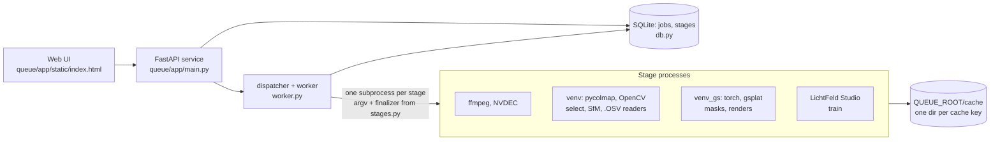
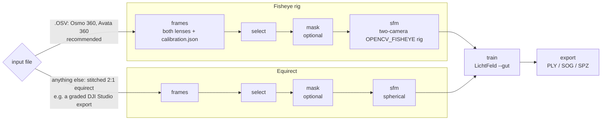
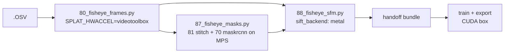

# How it works

What the pipeline does with a clip, why each stage is built the way it is, and
the measurements behind the defaults. For setup see [install.md](install.md);
for things that go wrong see [troubleshooting.md](troubleshooting.md).

## Architecture

Everything runs on one Linux workstation with an NVIDIA GPU: NVDEC decode,
frame selection, person masks, COLMAP SfM on the GPU and LichtFeld Studio
training, driven by a queue service with a web UI. The finished `.sog` can be
hosted on any static web server with a splat viewer; no server code.



The service itself has no numpy, OpenCV or torch: anything heavy is a
script in one of the two venvs, started and killed by process group.

## Two input paths



The queue picks the path from the file extension. The six stage names, the
cache, the review gate and the UI are shared; each stage dispatches on the
input. Per-stage detail is in [queue/README.md](../queue/README.md).

| Stage | What it does |
|---|---|
| `frames` | ffmpeg decode (CUDA) at `frames.fps` (default 10). For `.OSV`: both lens streams, plus `calibration.json` read out of the file. |
| `select` | Keep the sharpest frame of every `select.window` (Laplacian variance; for a rig, scored on the blurrier lens). Optional gyro veto, below. |
| `mask` | Optional person masks, below. |
| `sfm` | COLMAP 4.2 via pycolmap-cuda: GPU SIFT, sequential matching, incremental mapping. Picks the largest model, drops stray cameras, and gates on registration rate and reprojection error. For `.OSV`: levels the model, and puts it in metres when the clip has GPS (below). |
| `train` | LichtFeld Studio headless, MRNF strategy, 3M splat cap, SH degree 3, 30k iterations, 3DGUT rasterizer (`--gut`), which is the only way it trains fisheye and equirect cameras. |
| `export` | Collects `.ply`, `.sog` and `.spz`. |

Every stage is cached by a hash of the options that affect it. Changing a
training option reuses the frames, selection, masks and SfM.

## Fisheye rig (no stitch)

Both DJI 360 cameras write a per-unit lens calibration into every `.OSV`
([osmo360-telemetry.md](osmo360-telemetry.md), [avata360-telemetry.md](avata360-telemetry.md)).
Instead of stitching and running SfM on the panorama, each instant becomes one
frame of a **two-camera rig**, both cameras `OPENCV_FISHEYE` (the same
Kannala–Brandt model DJI stores), seeded from the file's values. No DJI Studio,
no seam.

On a 31 s handheld Osmo 360 clip, same 104 instants for every arm:

| Arm | Points | Median angular error |
|---|---|---|
| Stitched equirect (calibration as first read), spherical SfM | 47,080 | 0.0627° |
| Stitched equirect with the refined lens + rig | 57,398 | 0.0485° |
| **Fisheye rig, stored calibration read in full, held fixed** | **109,137** | **0.0439°** |

(Angular error, not pixels: a pixel means different things in a fisheye and an
equirect. `83_sfm_angular_error.py` unprojects every observation to a ray.)

Training both to the same budget and scoring the same held-out fisheye pixels:
the rig model won PSNR in 20 of 26 views (+0.29 dB mean) and SSIM in 25 of 26,
in about 60% of the training time. Most of the margin is at the lens rims,
where the stitched model smears. The splat-stage margin is small; the SfM-stage
margin is not. **For `.OSV` input, use the fisheye path** — the queue does so
automatically.

`scripts/osv_meta.py <clip> <outdir>` writes the calibration and a telemetry
CSV for any `.OSV` or `.LRF` on its own, if you want to look.

## Stitched video input (graded or D-Log footage)

The raw `.OSV` path reads the file straight off the camera, so it trains on the
colours the camera recorded. If you want to grade D-Log M footage, denoise, or
otherwise preprocess first, export a stitched equirectangular video instead and
queue that. It takes the stitched path: spherical SfM on the panoramas and
LichtFeld trained on the equirect frames.

- **Format:** `.mp4`, `.mov` or `.mkv`, 2:1 equirectangular, e.g. DJI Studio's
  *Panoramic Video* export at full resolution (7680×3840). Anything ffmpeg can
  decode works; H.265 decodes on the GPU.
- **Turn stabilization and horizon levelling off** in the export. They warp
  each frame differently, which SfM reads as the scene moving.
- **Colour:** the splat reproduces the pixels it is given, so grade before
  export if you want a graded splat. Ungraded D-Log reconstructs fine but
  gives an equally flat-looking splat.
- Put it in `~/splat/samples/` like any clip; the UI shows it as "stitched".

What the stitched path gives up, compared with the raw `.OSV`:

| | Raw `.OSV` | Stitched video |
|---|---|---|
| SfM | fisheye rig, ~2× the points (above) | spherical, one projection centre for both lenses |
| Seams | none | whatever the stitcher left |
| Gyro blur veto (`select.imu`) | yes | refused: no orientation stream |
| Distance-based selection (Avata 360) | yes | no: needs the flight telemetry |
| Upright splat, in metres with GPS (`sfm.upright`) | yes | refused: no orientation stream or GPS |
| Skip redundant points in global BA (`sfm.skip_redundant_points`, off by default) | yes | refused: stitched SfM does not use it |
| Person masking, review gate, presets, sweeps | yes | yes |
| Training resolution | full 3840² per lens | LichtFeld's `--max-width` (default 3840, i.e. 3840×1920 per panorama) |

## Person masking

On a handheld or selfie-stick 360 capture the operator is **rigidly attached
to the camera**: the same solid angle in every frame, never seen from a second
viewpoint. The trainer bakes them in as a smear along the camera path. No
trainer setting fixes that; the fix is to stop supervising those pixels.

`scripts/70_person_masks.py` has two backends:

| | `maskrcnn` (default) | `sam3` |
|---|---|---|
| Model | torchvision Mask R-CNN v2, COCO `person` | SAM 3, open-vocabulary text prompts |
| Inferences per panorama | 13 tangent views | 2 (equirect + nadir) |
| Time per frame (RTX 3090) | 0.70 s | 0.53 s |
| Setup | none, weights auto-download | one download of gated weights ([Docker](docker.md#sam-3-masks-optional), [native](install.md#optional-sam-3-masks)) |
| Licence | BSD-3-Clause | Meta SAM licence |

Evaluated over identical pixels, the two produce equivalent splats (scene-pixel
PSNR 21.33 vs 21.41 dB, against 20.91 unmasked). Pick on licence and setup, not
quality. SAM 3 can mask other things too (`"prompts": ["person", "dog"]`).

**The vehicle carrying the camera.** A boat, car or bike the camera rides on is
camera-fixed in the same way, and Mask R-CNN cannot mask it. With SAM 3, add it
to the prompts and name it in `attached`, for example on a boat:

```json
"mask": {"enabled": true, "backend": "sam3",
         "prompts": ["person", "boat", "boat deck", "life buoy"],
         "attached": ["boat"]}
```

An `attached` prompt keeps only the instances that reach 60° below the horizon
(`ATTACHED_LAT_DEG` in `70_person_masks.py`), i.e. the vehicle you ride on, and
leaves the same kind of object out in the scene unmasked. The test is purely
geometric, so it applies to any prompt, but it assumes a roughly level
panorama, and parts of the vehicle that stay above the horizon need an
unfiltered prompt of their own. Do not put `"person"` in `attached`: it would
mask only the operator and leave passers-by in.

Measured only on a boat so far. On 8 panoramas from a 10-minute River Aire
water-taxi clip (Osmo 360, handheld on deck), "boat" found one instance per
frame reaching −82° to −89° (the taxi, 14–16 % of the sphere) and 36 more that
never went below −15° (moored boats along the quay), and those 36 were dropped.
"boat deck" fills the deck floor that "boat" leaves out. The life rings stacked
on the cabin roof sit above the horizon, out of reach of `attached`, so they get
the unfiltered "life buoy" prompt: it found the stack in 4 of 4 frames (scores
0.41-0.77), plus one ring on a quay. A dark rope pile at the nadir is still
missed. The first three prompts (person, boat, boat deck) cost 3.9 s a panorama
on an M5 Max (MPS, equirect + nadir view); the four-prompt set was not timed.
Training on the result has not been compared with an unmasked run yet.

For `.OSV` input the masker runs on a calibrated stitch and the masks are
carried back into each fisheye through the same geometry. With
`"mask": {"review": true}` the job pauses after masking and releases its GPU
until you approve a contact sheet of overlays in the UI.

A masked run's PSNR is not comparable to an unmasked one — see
[troubleshooting #22](troubleshooting.md).

## Gyro blur veto

An `.OSV` carries the camera's orientation at 1 kHz (Osmo 360) or 4 kHz
(Avata 360), and every frame's exposure time. So each candidate frame's
rotational motion blur can be *predicted*:

**smear ≈ fx × mean |ω| over the exposure × exposure time**

With `"select": {"imu": true}`, candidates predicted to smear more than 0.5 px
beyond the stillest in their window are vetoed before the sharpness pick. On a
99 s indoor clip it cut frames predicted over 4 px of smear from 101 to 85, and
the swapped frames are visibly sharper. But the final splat came out the same
(+0.04 dB over 64 held-out views, p = 0.53), and in daylight exposures are too
short for it to change anything. It is **off by default**; try it for indoor
or dusk footage.

## Upright and in metres

SfM has no idea which way is down or how big anything is: the model comes out
in whatever frame and scale its first image pair implied, so a splat opens
tilted in a viewer and a measuring tool reads arbitrary units. The `.OSV`
knows both. With `"sfm": {"upright": true}` — **on by default for `.OSV`**
— `scripts/upright.py` fixes the model after SfM and before training:

1. **Gravity.** For each rig frame, the orientation stream is interpolated at
   mid-exposure and paired with lens 0's SfM pose. The lens-to-body rotation
   is *solved* from the frames' relative turns (the same turn seen by two
   sensors) instead of being read from the calibration, whose frame is
   unverified. Then the rotation from the SfM world to the stream's
   gravity-down world is averaged over the frames. It needs turns about two
   axes, which a walk or a flight has.
2. **Metres and north, when the clip has GPS fixes.** The levelled camera path
   is fitted to the fixes in local metres: scale, heading about the vertical
   and offset. Tilt stays gravity's, so a straight flight line is enough. The
   Avata 360 records GPS in every clip. The GPS message is found by content,
   so an Osmo 360 clip gets the same treatment once it carries a fix.

The trainer sees the transformed model, so the `.ply`, `.sog` and `.spz` come
out in this frame: **+y down** (COLMAP's and OpenCV's convention, which
SuperSplat shows upright, since it turns a loaded splat 180° about z), and
with GPS **metres, x east, z north**. The origin is the median camera
position. `sfm/alignment.json` keeps the transform and, with GPS, the
geographic reference of the origin. That file is the job's own; the stage
record, and so job telemetry, carry only the residuals and flags.

**It fails safe, never fails the job.**

| The clip | What you get | Stage record |
|---|---|---|
| Stream and GPS fit | upright, metres, north | `upright`, `metric` true; `gps_rms_m`, `gps_yaw_correction_deg` |
| No GPS fix (Osmo 360 today) | upright; SfM's units; heading is the stream's own, not verified to be north | `metric` false, no warning |
| GPS present but unusable: path under 20 m, or fit worse than 10 % of it | upright, SfM's units | warning with the reason |
| The stream does not fit the model: median residual over 2°, p90 over 5°, or turns about one axis only | the model as SfM made it | warning with the reason |

Where the path allows (not a straight line), the GPS fit also gives an
independent tilt; `gravity_vs_gps_deg` reports how far it is from the
stream's gravity, with a warning past 5°.

**What is measured, and what is not yet.** The solve is tested on synthetic
flights with a known answer (`scripts/test_upright.py`, `test_fisheye.py`):
tilt within 0.3°, scale within 1 % from exact fixes and 2 % with 1.5 m of GPS
noise, and a stream heading 30° off corrected by the GPS. pycolmap 4.2's
transform scales the rig baseline with the world, which the test checks. No
real clip has been run through it yet. Three things to check on the first
ones: that the Avata 360's stream is gravity-referenced like the Osmo 360's
(checked against the accelerometer there, [osmo360-telemetry.md](osmo360-telemetry.md) §6;
unverified on the Avata, which is what `gravity_vs_gps_deg` shows), the
residuals the gates were set for, and whether the splat's PSNR moves at all.
LichtFeld scales its position learning rate by the scene's extent, so it
should not.

## Capturing for a good splat

From aerial and handheld runs on both cameras, two things dominate quality and
neither is a trainer setting:

1. **How much of the sphere is static, textured surface.** A low pass over
   land gave the richest reconstruction; a lake filling the lower hemisphere
   gave haze.
2. **How close the subject is, and whether you orbit it.** A low, close orbit
   gave the finest detail even with worse SfM numbers.

So: **fly or walk low and slow, orbit what you care about, stay over land.**
Water, sky, and moving people, cars and boats contribute nothing and pull the
far field into haze. Handheld: keep the stick long and turn on person masking.
Keep the shutter fast (daylight, or a short exposure setting) — blur costs
more than resolution.

Measured on one RTX 3090 (a 3090 over OcuLink in a mini PC; a desktop 3090
was within a minute of it on the Draft run):

| Preset | Clip | Frames | frames+select | mask | sfm | train | total |
|---|---|---|---|---|---|---|---|
| Smoke test | 30 s of an Osmo walk | 100 rig | 1.0 min | 1.9 min | 4.1 min | 1.7 min | **9.5 min** |
| Draft | 2.5 min Osmo walk | 302 rig | 6.6 min | 5.2 min | 10.8 min | 12.0 min | **35 min** |
| Standard | 2.2 min Osmo walk | 267 rig | 5.9 min | 4.7 min | 9.1 min | 105.7 min | **125 min** |

Training dominates, and it is the one stage a preset changes most: Smoke and
Draft cut iterations and the splat cap, not frame density. Masking adds about
1 s per frame and only runs when people are in shot. The Standard run peaked
at **10.1 GB of VRAM** (3M splats, 3840 px training width). These runs used SH
degree 1 on the previous LichtFeld pin; Standard now trains SH 3, about 6 %
longer (below).

## Trainer options, measured

Clip 0005 (Osmo 360 walk, 957 rig frames, person masks), the same cached SfM
for every run, scored by LichtFeld on the same 240 held-out fisheye views.
RTX 3090s capped at 250 W; times are from one card, except where marked
(\*: a second 3090 at similar clocks, so approximate).

| Run | PSNR | SSIM | LPIPS | Time |
|---|---|---|---|---|
| LichtFeld `04e4607b` (previous pin), Standard | 21.910 | 0.6732 | – | 7,603 s |
| LichtFeld `e654717e`, Standard | 21.905 | 0.6728 | 0.2178 | 7,704 s |
| … SH degree 3 | 22.017 | 0.6773 | 0.2158 | ~+7 %\* |
| … 4.5M splats | 22.122 | 0.6815 | 0.2102 | 9,111 s |
| … 4.5M splats, SH 3 (the High preset) | 22.224 | 0.6860 | 0.2081 | 9,661 s |
| … 20k iterations (`steps_scaler` 0.667) | 21.717 | 0.6672 | 0.2226 | ~−31 %\* |
| … `background_improvements` | 21.849 | 0.6680 | 0.2218 | ~+36 %\* |
| … `exposure_correction` | 21.758 | 0.6733 | 0.2174 | – |
| … `--ppisp` | 21.781 | 0.6730 | 0.2178 | ~+7 %\* |

- The two builds are the same to within run-to-run noise: the same settings on
  two cards differed by 0.006–0.008 dB. Training time is identical; the
  newer build's extra 100 s is LPIPS in its evaluations, which is why the
  queue now evaluates once, at the end.
- Splat count and SH degree add up. SH 3 barely changes the `.sog` (39 MB
  against 38 MB); the `.ply` grows 2.4×. High used 16.2 GB of GPU memory
  against 12.8 GB for Standard, as `nvidia-smi` reports it.
- `background_improvements` is the only option that visibly cleared the
  grey haze over distant trees, which held-out PSNR does not reward. Exposure
  correction and PPISP cleared some of it; exposure correction also halved
  the renders' colour bias against the photos. Both change the colours the
  evaluator compares, so their PSNR is not like-for-like with the others.
- One clip: treat these as a first measurement, not a law.

### When to turn the appearance options on

All three are off by default and exposed in the UI and as `train.*` fields.
None of them is free, and none of them improves held-out PSNR, so pick them for
what they do to the picture.

| Option | What it does | Try it for | Cost (0005) | Watch out |
|---|---|---|---|---|
| `background_improvements` | Trains the far field (sky, distant trees) separately so it does not turn into grey haze | Outdoor clips where the distance matters: aerial passes, open views | ~+36 % training time, −0.06 dB | The clearest visual gain of the three; measured on one handheld clip only |
| `exposure_correction` | Per-photo exposure, white balance and vignetting, held to a zero mean so no colour cast slides into the splat | Clips whose lighting changes: sun and shade, turning towards the sun | −0.14 dB; colour bias against the photos halved | Replaces `bilateral_grid` and `ppisp`; the queue refuses the combinations |
| `ppisp` | Learns each lens's response (exposure, white balance, vignetting); the exported splat carries none of it | Rigs with visible lens vignetting or a colour difference between the lenses | ~+7 % training time, −0.12 dB | Not seeded with the `.OSV`'s per-frame exposure yet; the evaluator applies its correction, so PSNR is not like-for-like |

## Output formats

| Format | Typical size (2M splats) | For |
|---|---|---|
| `.ply` | ~200 MB | Lossless master; every tool reads it; the only one to retrain or re-decimate from. |
| `.sog` | ~27 MB | Web viewers ([SuperSplat](https://superspl.at/editor), PlayCanvas). |
| `.spz` | ~40 MB | Compact interchange (v4, zstd). |

## Prep on Apple silicon

Everything before training (frames, select, mask, SfM) runs on an Apple silicon
Mac from `scripts/setup_mac.sh`; training does not (LichtFeld and gsplat are
CUDA-only), so a Mac's output is meant to reach a CUDA box as a
[handoff bundle](cloud.md#split-pipeline). Only the fisheye rig pipeline is
ported: `30_run_sfm.py` refuses to run without CUDA.

`queue/run_mac.sh` starts the queue there. It is a prep install: a job must set
`run_until`, and `"sfm"` writes the bundle. The queue schedules on the Mac's one
GPU without `nvidia-smi`, so it has no guard against other programs using that
GPU, and runs one job at a time. Each job records the toolchain that preps it
(`prep_backend`, set by the host that creates the job), and a Mac's jobs carry
the term `PREP_APPLE` in every cache key: a reconstruction made on a Mac is not
the one a CUDA host makes from the same options (SIFT backend, ffmpeg and torch
all differ), so the two never share a cache entry. A CUDA host imports a Mac's
bundle under those keys and trains it; it refuses to build a prep stage of such
a job itself. Images older than this field refuse the bundle, as an unknown
config field.

Checked on 0141 through the queue (2026-10-02): frames 26 s, select 5 s, mask
420 s, sfm 1243 s, 28.2 min in all, 473 / 473 rig frames, 510,745 points at
0.807 px, and a 2.27 GB bundle that a second queue instance set to `cuda`
imported under the same six keys. That bundle was not trained. The bundles
trained below were made before the queue ran on a Mac, from the same stages run
by hand and packed around a CUDA run's manifest.



What differs from the Linux path, each measured on clip 0141 (Avata 360, 141.8 s,
473 rig frames = 946 images of 3840 px) on an M5 Max (18 cores, 128 GB), against
the prep-only cloud run of the same clip (Core Ultra 9 285K + RTX 5080,
0.2.0-rc3, 2026-09-30), 2026-10-01 and 02:

- **SIFT extraction runs in Metal.** COLMAP 4.2.1 has no GPU SIFT on macOS: the
  PyPI wheel is built without CUDA, OpenGL and ONNX, and its VLFeat is scalar on
  arm64. `setup_mac.sh` builds pycolmap from a fork instead,
  [pgodlews/colmap](https://github.com/pgodlews/colmap) branch
  `metal-sift-lanxinger`, pinned by commit: lanxinger/colmap-metal (COLMAP
  4.2.0-dev with selected 4.2.1 fixes and SIFT in Metal compute shaders) plus
  one commit that sorts each image's features into a fixed order. So the Mac's
  COLMAP is not the 4.2.1 release the Linux pin is. The order is fixed but the
  feature set is not: on images this large, candidates past the extractor's
  buffer are dropped in GPU arrival order, and two extractions of 24 images at
  3200 px shared 99.9 % of keypoint positions, none byte-identical.
- **Matching stays on the CPU** (FAISS). The fork has a Metal matcher too; on
  this clip it took 309 s where the CPU took 236 s, and the two models' camera
  centres differ by 0.0007 % of the path length (median; at most 0.0028 %).
- **`scripts/sift_backend.py` picks the backend** (`cuda`, `metal`, `cpu`;
  `SPLAT_SIFT` overrides). pycolmap turns `use_gpu` off unless `device` says
  CUDA, so the Metal build is driven with `device=pycolmap.Device.cuda`.
- **Masks run on MPS with a newer torch** (2.14.1, torchvision 0.29.1). With the
  Linux pin (2.9.1 / 0.24.1) `torchvision.ops.roi_align` takes 92 s per 1000
  boxes on MPS, 0.2 s on the CPU and 0.02 s with 2.14.1. `81_fisheye_stitch.py`
  builds its float64 sampling grids on the CPU there (Metal has no float64).
- **Decoding uses VideoToolbox**, whose frames are byte-identical to ffmpeg's
  software decoder on the same machine (2836 of 2836 JPEGs).

| 0141, SfM stage | Mac, Metal SIFT | Mac, CPU SIFT (PyPI wheel) | CUDA run |
|---|---|---|---|
| extract / match / map | 85 / 236 / 797 s | 775 / 213 / 730 s | not split; map ~798 s |
| `seconds_sfm` | 1121 | 1721 | 1014 |
| registered rig frames | 473 / 473 | 473 / 473 | 473 / 473 |
| 3D points | 510,391 | 498,907 | 381,979 |
| mean reprojection error | 0.806 px | 0.904 px | 0.979 px |
| angular error, median / p90 | 0.034 / 0.092 deg | 0.040 / 0.099 deg | 0.043 / 0.104 deg |
| keypoints per image, after masks | 11,085 | 10,264 | not recorded |
| peak memory | 9.6 GB | 56 GB | not recorded |
| trained from it: PSNR / SSIM / LPIPS | 27.109 / 0.8342 / 0.1240 | 26.938 / 0.8315 / 0.1268 | 27.010 / 0.8316 / 0.1265 |

Both Mac runs used the CUDA run's selected images and person masks, so the
table isolates the SfM stage. The last row is the queue's own evaluation after
training each model on an RTX 3090 (30,000 iterations, 3M splats, 0.2.0-rc3
train image), one run per column; two trainings of one model differed by about
0.005 dB on another clip, so the Metal column is not worse than CUDA, and one
clip does not show it is better. After a similarity alignment of the 946 camera
centres, the Metal model differs from the CUDA model by 0.012 % of the path
length (median; at most 0.027 %) and 0.10 degrees in rotation; the CPU SIFT
model by 0.006 % (at most 0.027 %) and 0.03 degrees. The Metal extractor keeps
up to two orientations for each of its 8192 features, which is where its extra
keypoints come from.

An earlier build is recorded as a null. The Metal SIFT of byplay-io/colmap-metal
on the 4.2.1 tag, with four fixes made here (a 4096-per-octave candidate cap,
output order, embedded shaders, the half-pixel keypoint origin), was faster
(`seconds_sfm` 777 to 1023) but trained to 26.83 to 26.88 dB in five runs on
these frames, whatever the feature budget (8192, 10,000, 18,000), the keypoint
origin or the intrinsics (fixed to the CPU SIFT model's). The cause was not
found. It is branch `metal-sift-4.2.1` of the same fork.

| 0141, other stages | Mac | CUDA run | Output against the CUDA run |
|---|---|---|---|
| frames (VideoToolbox) | 26 s | 2.6 min | same frames, 46.8 to 48.1 dB: the image's ffmpeg is 6.1, the Mac's 8.1 |
| select | 4 s | 0.1 min | 472 of 473 picks identical |
| mask (Mask R-CNN, MPS) | 421 s | 154 s | the same 84 frames without a detection; coverage 0.003636 vs 0.003629 |

The mask stage sets `net.roi_heads.score_thresh` to the mask's own score on MPS
(40 panoramas: 54 s to 31 s, no pixel changed; not checked on CUDA, so not
applied there). Half-precision masks were tried and dropped: 286 s instead of
385 s, but two detections lost. A whole prep run, every stage on the Mac, was
timed with the earlier build: 24.6 min and 27 Wh at 66 W mean, and it trained to
26.923 dB. With the current build the SfM stage alone is 1121 s; the whole run
was not timed again.

A second clip, with every stage made on the Mac by the current build: 0005 (Osmo
360, 296.9 s trimmed to 5 to 291.9 s, 957 rig frames, a person in every frame),
against a prep of the same job on an RTX 3090 with a Ryzen 7 H 255 (0.2.0-rc3),
both trained as above, 2026-10-02:

| 0005, whole prep | Mac | CUDA run |
|---|---|---|
| frames / select / mask / sfm | 74 / 9 / 806 / 2220 s | 752 / 14 / 511 / 2809 s |
| whole prep | 51.8 min | 68.1 min |
| selected frames | 957, the same 957 | 957 |
| mask coverage, mean | 0.04706 | 0.04720 |
| registered rig frames | 957 / 957 | 957 / 957 |
| 3D points | 900,396 | 832,860 |
| mean reprojection error | 0.951 px | 1.068 px |
| angular error, median / p90 | 0.040 / 0.098 deg | 0.046 / 0.107 deg |
| trained from it: PSNR / SSIM / LPIPS | 21.990 / 0.6770 / 0.2155 | 22.027 / 0.6775 / 0.2156 |

Each column is evaluated against its own decoded frames, one run each. Over the
two clips the Mac's PSNR is 0.10 dB above and 0.04 dB below the CUDA run's, with
SSIM and LPIPS within 0.003: no difference in either direction is shown. Not
measured: a Mac smaller than this one. SAM 3 masks run on MPS in float32 at
3.9 s a panorama with three prompts (person, boat, boat deck), against 0.53 s
on a 3090 with one; `setup_mac.sh` installs `transformers` for it.


## Pinned toolchain

The setup scripts pin the exact commits this pipeline was validated at, so a
rebuild months later does not silently produce a different trainer:

| Component | Pin | Override |
|---|---|---|
| LichtFeld Studio | `3067e9e0`, plus `scripts/lichtfeld-patches/` | `LFS_REF` |
| vcpkg | `04a9d8e5` (2026.07.29) | `VCPKG_REF` |
| gsplat (renders and evaluation only) | `28e794ca` (1.6.0), torch 2.9.1+cu130 | `GSPLAT_REF` |
| pycolmap-cuda12 | 4.2.1 | edit `setup_sfm_venv.sh` |
| pycolmap on a Mac | pgodlews/colmap `0fea5683` (`metal-sift-lanxinger`, COLMAP 4.2.0-dev), torch 2.14.1 (MPS) | `COLMAP_REF` in `setup_mac.sh` |

The LichtFeld patches only add options (`--save-steps`, and SIGUSR1 for a
snapshot in headless mode; see each patch's header) and change no default, so
they do not move `TRAINER`. A patch that no longer applies to a new `LFS_REF`
stops the build.
